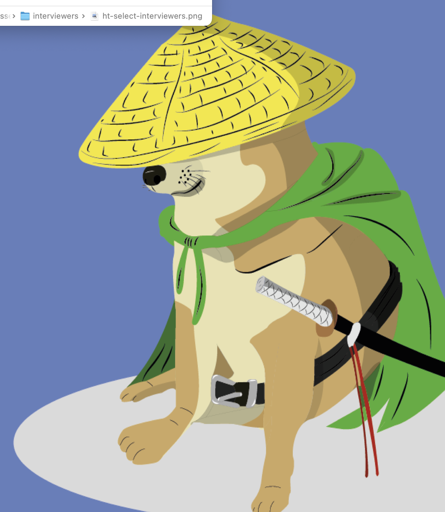

HOME
Version 5

### Link to other wiki page (There are no folders)

- [Calendar](calendar)

### Sites outside wiki

- [Staging site](https://google.com.mx)

# API

## Routes (The MD files are at root folder)

-  [auth_token](#auth-token)
- {height=400px width=500px}
- 
- ![alt text][cheems]{height=400px width=500px}
- 
- 2
- 2
- 2
- 2
- 2
- 2
- 2
- 2
- 2
- 2
- 3
- 3
- 3
- 3
- 3
- 3
- 3
- 3
- 3
- 3
- 3
- 3
- 3
- 3
- 3
- 3
- 3

### POST /auth_token

[//]: # (Image References)
[cheems]: ./assets/cheems.png "This is cheems"
